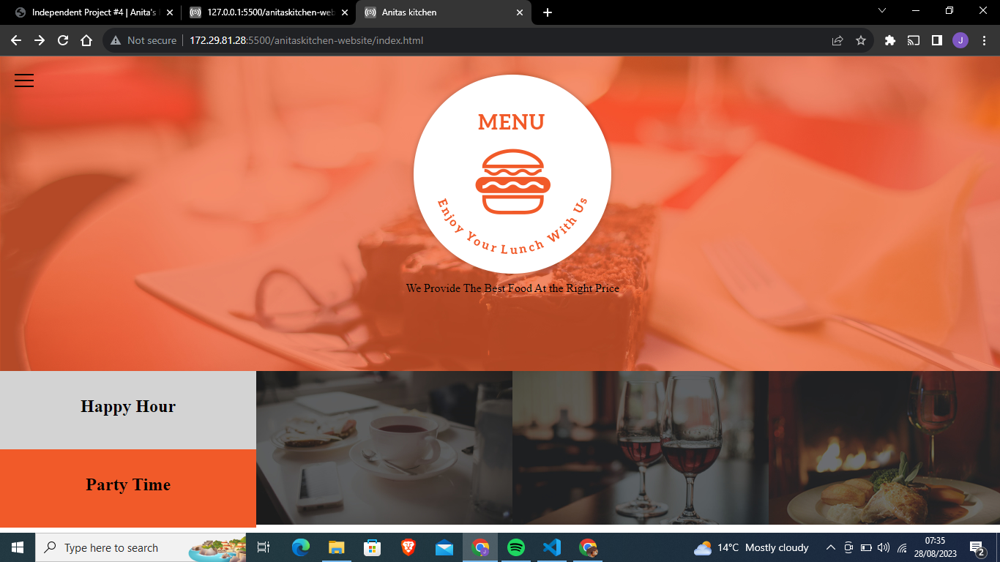
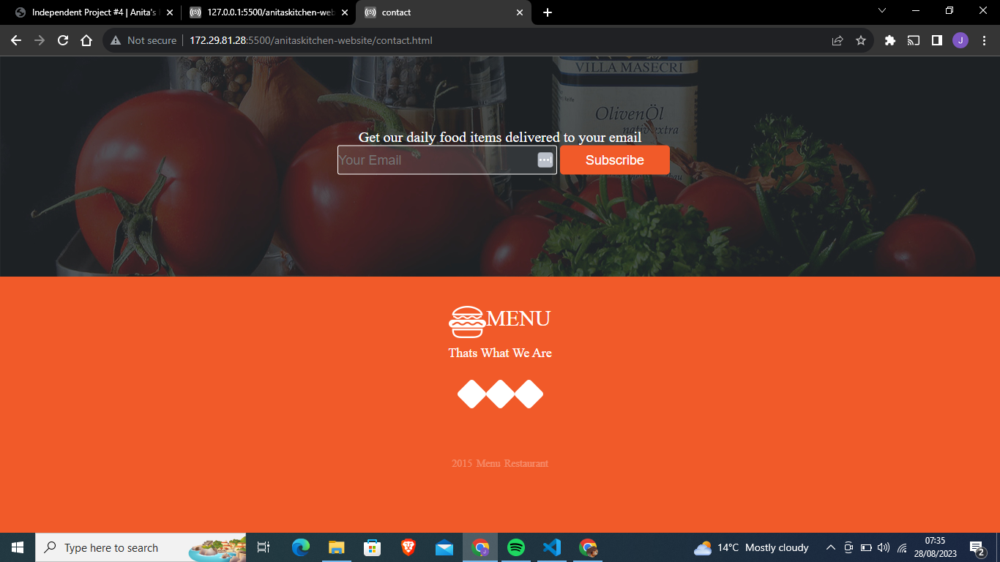

# Anitaskitchen Website
This is a HTML and CSS website about a Anitas kitchen whereby it has a navigation bar that enables one to be able to go the different pages of the website.The website has a gallery page that shows the food and drinks that are on offer, a contact page whwereby users are able to subscribe by entering their email address it has an about page that has details abut our customers and their reviews and it also has a menu page that shows the different foods and drinks that are on offer.heres is the link to the live page  https://torry7077janny.github.io/Anitaskitchen-website/

## TOOLS USED TO CREATE
This website was built with the following tools:
<ol type="1" >
<li>HTML</li>
<li>CSS</li>
<li>FONTAWESOME</li>
</ol>

## Pre-requisites
Inorder for one to be able to run the website  you will need:
-linux/windows machine.

-Atleast 4Gb of RAM

-Strong internet connection

-Visual studio code

-Github account

-Chrome browser

## Setup
This is how you will be able to setup and be able to run this code on your computer through the following steps:

1.First you will open the google chrome in your computer and your git hub account.

2.Once you are in your git hub account you write this repository  https://github.com/Torry7077janny/Anitaskitchen-website.git in your search box in the github account.

3.After you have clicked on the repository you click the blue link with the word code on it.

4.Once you have done that you should open your terminal and write the following

\\\
git clone  https://github.com/Torry7077janny/Anitaskitchen-website.git

\\\

5.In your terminal you change it into working directory.

6.In your terminal you will type

\\\
code .
\\\
so as to be able to open to your visual studio code .

7.In your visual studio code you click on open liveserver that should take you to chrome browser and you will be able to view the Anitas kitchen website.

## Screenshots 
These are some of the images of the pages in the website:

| Home page                                        | our contact                                          |
| -------------------------------------------------| ---------------------------------------------------- |
|                        |                      |

## Author
This website is built by Janice Kinyua [Torry](https://github.com/Torry7077Janny)

## ISSUES
There are no known issues

## LICENSE
MIT License

Copyright (c) 2023 JANICE KINYUA

Permission is hereby granted, free of charge, to any person obtaining a copy
of this software and associated documentation files (the "Software"), to deal
in the Software without restriction, including without limitation the rights
to use, copy, modify, merge, publish, distribute, sublicense, and/or sell
copies of the Software, and to permit persons to whom the Software is
furnished to do so, subject to the following conditions:

The above copyright notice and this permission notice shall be included in all
copies or substantial portions of the Software.

THE SOFTWARE IS PROVIDED "AS IS", WITHOUT WARRANTY OF ANY KIND, EXPRESS OR
IMPLIED, INCLUDING BUT NOT LIMITED TO THE WARRANTIES OF MERCHANTABILITY,
FITNESS FOR A PARTICULAR PURPOSE AND NONINFRINGEMENT. IN NO EVENT SHALL THE
AUTHORS OR COPYRIGHT HOLDERS BE LIABLE FOR ANY CLAIM, DAMAGES OR OTHER
LIABILITY, WHETHER IN AN ACTION OF CONTRACT, TORT OR OTHERWISE, ARISING FROM,
OUT OF OR IN CONNECTION WITH THE SOFTWARE OR THE USE OR OTHER DEALINGS IN THE
SOFTWARE.

